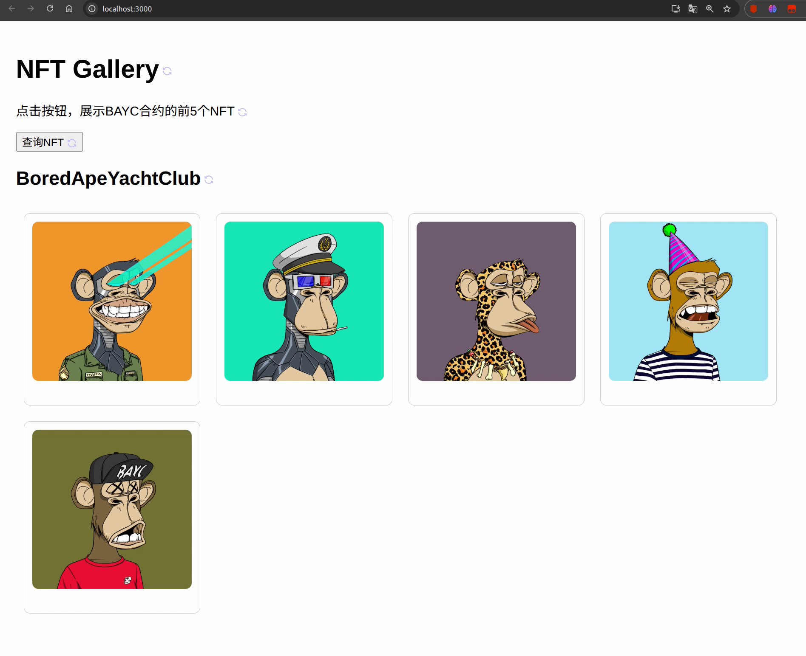

# NFT-Gallery
构建一个简单的NFT展示DApp (NFT Gallery)

<div align="left">
  <!-- Keep these links. Translations will automatically update with the README. -->
  <a href="https://zdoc.app/de/jedi9t/NFT-Gallery">Deutsch</a> | 
  <a href="https://zdoc.app/es/jedi9t/NFT-Gallery">Español</a> | 
  <a href="https://zdoc.app/fr/jedi9t/NFT-Gallery">Français</a> | 
  <a href="https://zdoc.app/ja/jedi9t/NFT-Gallery">日本語</a> | 
  <a href="https://zdoc.app/ko/jedi9t/NFT-Gallery">한국어</a> | 
  <a href="https://zdoc.app/pt/jedi9t/NFT-Gallery">Português</a> | 
  <a href="https://zdoc.app/ru/jedi9t/NFT-Gallery">Русский</a> | 
  <a href="https://zdoc.app/en/jedi9t/NFT-Gallery">English</a>
</div>
<br/>
# 技术栈与预备知识
## 预备知识:

基础的 HTML, CSS, JavaScript 知识。

对 React 有初步了解（知道组件和状态即可）。

电脑上已安装 Node.js 和 npm (或 yarn)。

浏览器安装了 MetaMask 钱包（本项目中仅用于提供网络连接，不涉及交易）。

## 核心技术栈:

React: 用于构建前端用户界面。

Ethers.js: 用于连接以太坊和与智能合约交互的JavaScript库。

Alchemy: 我们将用它作为节点服务商，为我们的dApp提供稳定可靠的区块链访问。

# 实践步骤 (Step-by-Step Guide)
## 步骤 A: 环境搭建
1. 创建React项目: 打开你的终端（命令行工具），输入以下命令来创建一个新的React项目。
   
   ```
   npx create-react-app nft-gallery
   cd nft-gallery
   ```

1. 安装Ethers.js: 进入项目目录后，安装我们需要的核心库。
   ```
    sudo npm install ethers
   ```
## 步骤 B: 获取[Alchemy API](https://www.alchemy.com/)密钥
访问 Alchemy 官网并注册一个免费账户。

登录后，在Dashboard（仪表盘）点击 “+ CREATE APP”。

Chain 选择 Ethereum，Network 选择 Mainnet。

创建成功后，点击 “VIEW KEY”，复制你的 HTTPS 地址。它看起来像 https://eth-mainnet.g.alchemy.com/v2/YOUR_API_KEY。请妥善保管。


## 步骤 C: 编写核心代码
打开项目文件夹中的 src/App.js 文件，编辑页面


## 步骤 D: 运行与测试
1. 回到你的终端，确保你还在 nft-gallery 项目目录下。

2. 运行以下命令来启动应用：
   ```Bash
   npm start
   ```
3. 你的浏览器会自动打开一个新标签页，地址为: http://localhost:3000
4. 点击页面上的“查询NFT”按钮，等待片刻，你就能看到无聊猿（BAYC）的前5个NFT图片和它们的名称了！


## 注：环境变量设置
在 nft-gallery目录下建立一个.env文件
增加如下代码：
```
REACT_APP_ALCHEMY_KEY=[YOUR_KEY]
```
